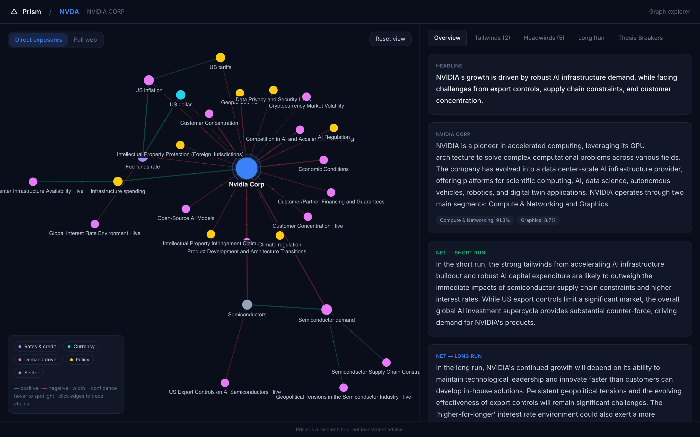
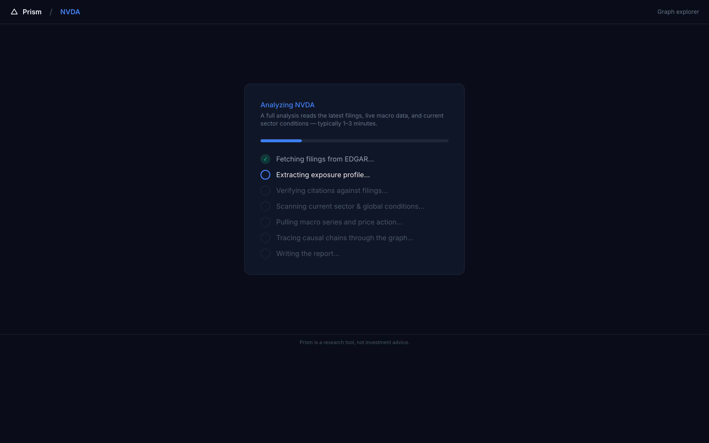
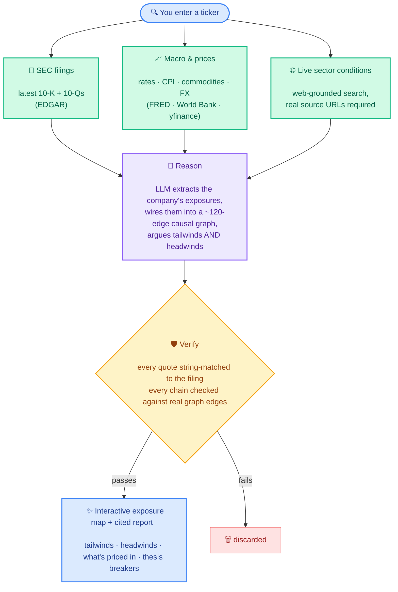
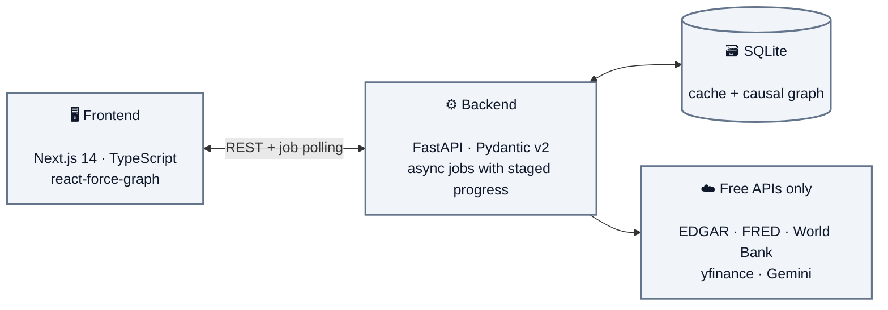
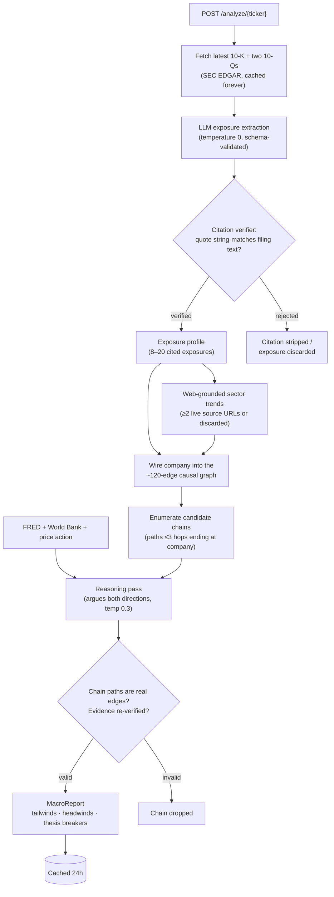

# What Moves Your Stock

**Prism** — enter a ticker; get an interactive
macro exposure network map and a cited, traceable macro analysis report —
tailwinds, headwinds, what's priced in, and what would falsify the thesis.



> Prism is a research tool, not investment advice.

## Why this exists

When the Fed cuts rates, copper rallies, or China's property market slides —
what does that actually mean for the stock *you're* watching? The answer
exists, but it's scattered across 700,000 characters of SEC filings, a dozen
macro data series, and this week's industry news. Most people either guess,
or borrow someone else's opinion.

The obvious shortcut — asking a chatbot — has a known failure mode:
confident, plausible, uncited answers that are sometimes simply made up.

Prism's answer is to make the reasoning **traceable** and the evidence
**mechanically verifiable**:

- **Every claim carries a verbatim quote** from the company's own 10-K/10-Q,
  string-matched against the filing text in code — hallucinated citations are
  rejected before they render.
- **Every causal story is a real path** through an explicit, hand-curated
  ~120-edge macro graph (`rates → housing → homebuilders`), not free-form
  prose — chains the LLM invents get dropped.
- **Price context is built in** — each chain notes what recent market moves
  already reflect ("copper +41% y/y — largely priced in").
- **Both sides get argued.** Every report has tailwinds *and* headwinds, plus
  concrete falsifiers ("copper below $9,000/t for two straight quarters").

## What you'd use it for

- **Understand a holding in five minutes.** One screen shows what the company
  is actually exposed to — by its own filings, not by vibes — and how those
  forces are trending right now.
- **Triage a headline.** "New tariffs announced" — open the map, click the
  tariff node, and see exactly which paths lead from that policy to the
  company, with lags and confidence.
- **Check what's priced in.** Every chain is annotated against trailing price
  action of the stock and its commodity/sector proxies, so you can separate
  "real development" from "already in the price."
- **Monitor a thesis.** The Thesis Breakers tab is a checklist of observable
  events that would falsify the analysis — the things worth watching.
- **Learn how macro actually transmits.** The standalone graph explorer is an
  interactive map of textbook macro linkages — hover `Fed funds rate` and
  watch the consequences light up.

## How it works

1. **Extract** — the latest 10-K + two 10-Qs are pulled from SEC EDGAR and an
   LLM extracts a structured exposure profile. Every exposure must carry a
   verbatim quote, string-verified against the filing text; hallucinated
   citations are rejected.
2. **Situate** — exposures are wired into a hand-curated ~120-edge macro
   causal graph, enriched with web-sourced sector trends (each requires ≥2
   live source URLs), live FRED/World Bank macro series, and trailing price
   action for the ticker and its ETF proxies.
3. **Reason** — one reasoning pass argues both directions along real graph
   chains, producing tailwinds, headwinds, net short/long-run assessments,
   and concrete thesis breakers. Chain paths and citations are re-validated
   in code.

<details>
<summary>A first analysis takes 1–3 minutes, with a staged progress screen driven by real pipeline state</summary>



</details>

## Architecture

Three stages: **gather → reason → verify**. Nothing the LLM asserts reaches
the screen unless it survives the verify gate.



### The stack



<details>
<summary><b>Engineer's view — the full pipeline, gate by gate</b></summary>



</details>

## Quickstart

Prereqs: Python 3.11+, Node 18+, and two **free** API keys (no credit card):

- **Google Gemini** — https://aistudio.google.com/apikey (all LLM calls)
- **FRED** — https://fred.stlouisfed.org/docs/api/api_key.html (macro series)

### 1. Backend (port 8000)

```bash
cd backend
python3 -m venv .venv && source .venv/bin/activate
pip install -r requirements.txt
cp ../.env.example .env       # then edit: set GEMINI_API_KEY and FRED_API_KEY
uvicorn app.main:app --port 8000
```

### 2. Frontend (port 3000)

```bash
cd frontend
npm install
npm run dev
```

Open http://localhost:3000 and search a ticker (try FCX). A first analysis
takes 1–3 minutes with a real staged progress screen; results are cached for
24h in `backend/prism.db`, so revisits are instant.

## Pages

- `/` — ticker search with EDGAR autocomplete
- `/t/[ticker]` — the analysis: network map (left) + cited report tabs (right).
  Click nodes for details, click edges to light up the full causal chain.
- `/graph` — the full seed causal graph, browsable standalone

## API

| Endpoint | Description |
|---|---|
| `POST /analyze/{ticker}` | Kick off analysis; returns `job_id` (idempotent, cached <24h) |
| `GET /status/{job_id}` | Real pipeline stage + percent |
| `GET /report/{ticker}` | MacroReport JSON |
| `GET /profile/{ticker}` | ExposureProfile JSON |
| `GET /graph/{ticker}` | Company subgraph (nodes + edges) |
| `GET /graph` | Full seed causal graph |
| `GET /tickers?q=` | EDGAR ticker autocomplete |

## Tests

```bash
cd backend
python -m pytest tests -q
```

38 tests cover the citation verifier (hallucination rejection), filing
section carving, seed-graph integrity, subgraph wiring (edge signs, trend
nodes, standalone exposures), reasoning-engine guardrails (invalid chain
paths dropped, unverifiable evidence stripped), cache TTL semantics, and
trend topic selection. No network or API keys required — they also run in CI
on every push.

## Acceptance scripts

```bash
cd backend
python scripts/prove_phase_a.py    # data clients: EDGAR / FRED / yfinance
python scripts/prove_phase_b.py    # exposure extraction + citation verification
python scripts/prove_phase_c.py    # seed graph + subgraph wiring
python scripts/prove_phase_c2.py   # web-grounded sector trends
python scripts/prove_phase_d.py    # full reasoning engine report
```

## Deploying a public demo (free)

The repo ships a demo mode: pre-analyzed tickers (see `backend/data/demo_cache.db`,
built with `scripts/make_demo_cache.py`) are served instantly and forever, and
visitors may run `ANALYSIS_DAILY_BUDGET` (default 3) fresh analyses per day on
the host's keys — after that, new tickers get a friendly "budget used, try
these or come back tomorrow" message instead of an error. The host's LLM quota
can't be drained.

1. **Backend on Render** — New → Blueprint → select this repo. `render.yaml`
   configures everything (`DEMO_MODE=true`); you'll be prompted for your
   `GEMINI_API_KEY` and `FRED_API_KEY`. Note the service URL.
2. **Frontend on Vercel** — Add New → Project → import this repo, set
   **Root Directory** to `frontend`, and add env var
   `NEXT_PUBLIC_API_URL=https://<your-render-service>.onrender.com`.

Free-tier caveat: Render spins the backend down when idle; the first visit
after a quiet spell takes ~30–60s to wake.

## Notes on the free tier

Gemini free-tier quotas are small and per-model (e.g. 20 requests/day on
`gemini-2.5-flash`). Prism ships a model ladder
(`2.5-flash → 3-flash-preview → 2.5-flash-lite`) with automatic fallback on
quota exhaustion and backoff on rate limits — expect roughly 1–2 fresh
analyses per day per key; cached tickers are unlimited. To run on Claude
instead, set `ANTHROPIC_API_KEY` and `LLM_PROVIDER=anthropic` in
`backend/.env`.
